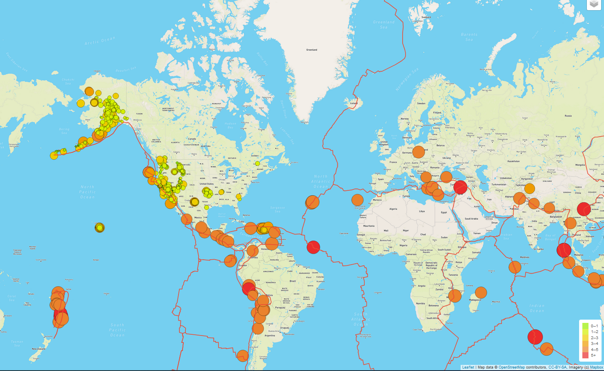
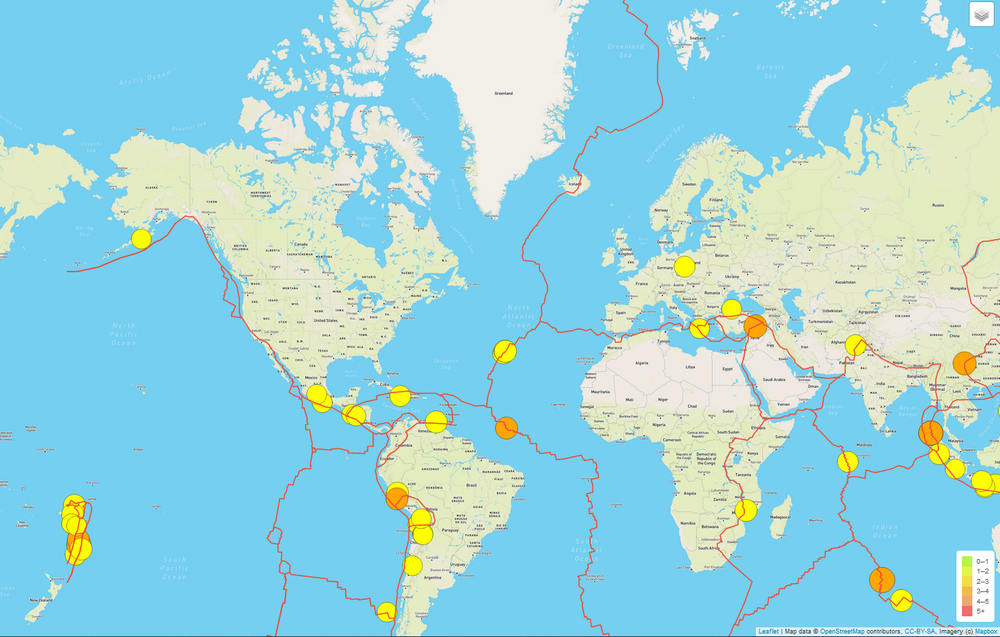
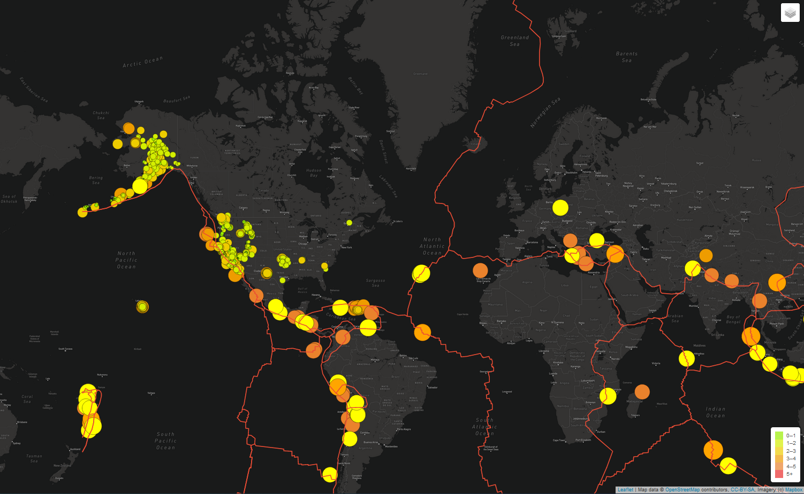

# Mapping Earthquakes with JS & APIs

### Overview of the Analysis

The purpose of this analysis was to:

1. Create an earthquake map in relation to the location of the tectonic plates
2. Visualize all of the earthquakes with a magnitude greater than 4.5
3. Visualize all of the data on a third map type

To do that, we had to:

1. Add Tectonic plate data
2. Add Major Earthquake data
3. Add a third map type

### Results

We were able to:
1. Populate the map with the earthquake data and tectonic plate data.

2. Populate the map with the two earthquake data sets and the tectonic plate data.

3. Populate the map with the three map styles, two earthquake data sets, and the tectonic plate data.

### Summary

Overall, I am very pleased with how this webpage turned out. We were able to populate the map with two earthquake data sets and tectonic plate data, while allowing the user to choose between three different map styles.

